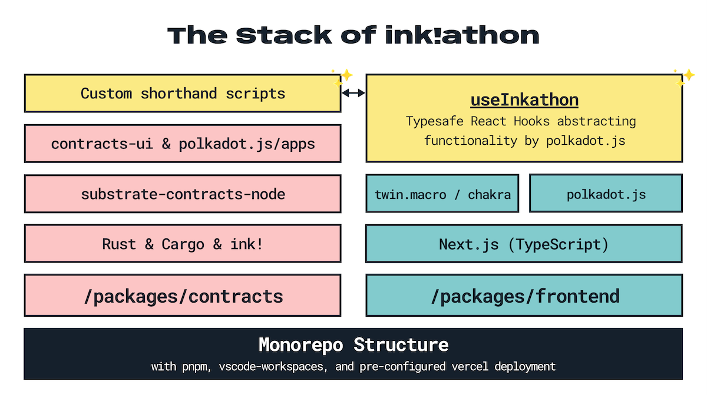

`Built from ink!athon – DApp Boilerplate for Substrate & ink!`


---

This is built on [`useInkathon` React Hooks](https://github.com/scio-labs/use-inkathon) that abstract & improve the polkadot.js experience.

By [Bolaji Ahmad](https://linkedin.com/in/bolajahmad) 🪄

---

**Table of Contents:**

1. [The Stack](#the-stack)
2. [Setup and Installation](#setup-and-install)
   1. [Start the Frontend](#frontend-quickstart)
   2. [Running the contracts](#run-the-contracts)
   3. [VSCode Setup](#vscode-setup)
6. [Customization](#customization)
7. [Environmnent Variables](#env-variables)
8. [FAQs \& Troubleshooting](#faqs--troubleshooting)

---

## The Stack



<details>
<summary><strong>The Stack in Detail</strong></summary>

- Structure: Monorepo
- Package-Manager: `pnpm`
- Smart Contract Development: `ink!`, `rust`, `cargo`, `cargo-contract`, `contracts-node`
- Frontend: `next`, `react`, `typescript`
  - Contract Interactions: `polkadot-js`, [`useInkathon` React Hooks](https://github.com/scio-labs/use-inkathon)
  - Styling: `chakra`, `tailwindcss`, `twin.macro`, `emotion`
- Misc:
  - Linting & Formatting: `eslint`, `prettier`, `husky`, `lint-staged`
- Deployment: Vercel

</details>


## Setup and Installation 🚨

This repository contains code for the Proownas DAO Decentralized application. More information about the DAO can be found in (the DAO doc)[./packages/contracts/README.md].

There are 2 applications in the `./packages` folder namely: `contracts` and `frontend`.

### Start the Frontend

Assuming you have NodeJS installed, Installed pnpm also (the project is managed by pnpm).

```bash
  # From the root folder run the following commands

  1. pnpm install

  # Copy and paste environment variables to env.<environment> file
  # Be sure to update with actual values after
  2. cp packages/frontend/.env.local.example packages/frontend/.env.local

  # Navigate to frontend directory (recommended)
  3. cd packages/frontend

  # Start the frontend (it should start on http://localhost:3000)
  4. pnpm dev

```

To run the frontend successfully, be sure to update the `NEXT_PUBLIC_WEB3STORAGE_TOKEN` with a token of your choice (or contact (bjahmad4tech@gmail.com)[mailto:bjahmad4tech@gmail.com])


### Running the contract

```bash
# If the following 3 are not available, be sure to install them
1. Setup Rust: https://docs.substrate.io/install/
# NOTE: Skip the "Compile a Substrate node" section

2. Install ink! cli (cargo contract): https://github.com/paritytech/cargo-contract

3. Install local contracts node: https://github.com/paritytech/substrate-contracts-node

# Navigate to contracts directory
4. cd packages/contracts

# Compile and build the contract
# Build Contracts & move deployments to `./deployments/{contract}/` folders
# NOTE: When adding/renaming your contracts, edit them in `build-all.sh`
5. pnpm build

# Deployment files can be found in the ./src/packages/contracts/deployments folder.
# Each folder contains .contract/.wasm/metadata.json files
# The .contract file can be deployed by uploading to (Substrate Contracts UI)[https://contracts-ui.substrate.io/]

# Test Contracts
# NOTE: When adding/renaming your contracts, edit them in `test-all.sh`
pnpm test

```


### VSCode Setup

#### Workspace

I strongly recommend developing in VSCode by opening the workspace file located at `.vscode/inkathon.code-workspace` instead of just the directory. This has multiple advantages and assures a more predictable monorepo configuration. The first plugin listed below will help with getting used to it.

#### Plugins

I strongly recommend installing all plugins listed inside `.vscode/extensions.json`. They should be suggested automatically by VSCode.

<details>
<summary><strong>Plugin Details</strong></summary>

1. [`zoma.vscode-auto-open-workspace`](https://marketplace.visualstudio.com/items?itemName=zoma.vscode-auto-open-workspace) – Automatically suggests opening the according `.code-workspace` file.
2. [`dbaeumer.vscode-eslint`](https://marketplace.visualstudio.com/items?itemName=dbaeumer.vscode-eslint) – Adds ESLint editor support.
3. [`esbenp.prettier-vscode`](https://marketplace.visualstudio.com/items?itemName=esbenp.prettier-vscode) – Adds Prettier editor support.
4. [`bradlc.vscode-tailwindcss`](https://marketplace.visualstudio.com/items?itemName=bradlc.vscode-tailwindcss) & [`lightyen.tailwindcss-intellisense-twin`](https://marketplace.visualstudio.com/items?itemName=lightyen.tailwindcss-intellisense-twin) – Adds tailwindcss & twin.macro editor support.
5. [`tamasfe.even-better-toml`](https://marketplace.visualstudio.com/items?itemName=tamasfe.even-better-toml) – Adds `.toml` file support.
6. [`rust-lang.rust-analyzer`](https://marketplace.visualstudio.com/items?itemName=rust-lang.rust-analyzer) – Adds Rust language support.
7. Optional: [`gruntfuggly.todo-tree`](https://marketplace.visualstudio.com/items?itemName=gruntfuggly.todo-tree) & [`wayou.vscode-todo-highlight`](https://marketplace.visualstudio.com/items?itemName=wayou.vscode-todo-highlight) – Lists all `TODO` comments in your workspace.
8. Optional: [`mikestead.dotenv`](https://marketplace.visualstudio.com/items?itemName=mikestead.dotenv) – Adds syntax highlighting for `.env` files.

</details>


## Environment Variables

The only mandatory environment variable you need to add is `NEXT_PUBLIC_WEB3STORAGE_TOKEN`. Just set it to *_YOUR-API-KEY-FROM-WEB3STORAGE_*  as there are defaults for other values.

Please see all pre-defined environment variables below and find more info in [`packages/frontend/.env.local.example`](https://github.com/scio-labs/inkathon/blob/main/packages/frontend/.env.local.example). All available blockchain network identifiers are defined in the [`useInkathon` repository](https://github.com/scio-labs/use-inkathon/blob/main/src/chains.ts).

| Environment Variable           | Value                          |
| ------------------------------ | ------------------------------ |
| `NEXT_PUBLIC_PRODUCTION_MODE`  | `true`                         |
| `NEXT_PUBLIC_URL`              | `https://localhost:3000` |
| `NEXT_PUBLIC_DEFAULT_CHAIN`    | `shibuya`            |
| `NEXT_PUBLIC_SUPPORTED_CHAINS` | `["alephzero-testnet", "shibuya"]`|
| `NEXT_PUBLIC_WEB3STORAGE_TOKEN`| `YOUR-API-KEY-FROM-WEB3STORAGE` |
`        |

### Contract Deployment

Please see the [Contract Quickstart](#contracts-quickstart) section above.

## FAQs & Troubleshooting

<details>
<summary><strong>Resources to learn more about Substrate, ink!, and polkadot.js</strong></summary>

- [Polkadot Builder's Guide](https://wiki.polkadot.network/docs/build-index)
- [Substrate Documentation](https://docs.substrate.io/)
- [Awesome Substrate](https://github.com/substrate-developer-hub/awesome-substrate)
- [ink! Documentation](https://use.ink/)
- [OpenBrush Documentation](https://docs.openbrush.io/)
- [polkadot.js Documentation](https://polkadot.js.org/docs/)

</details>
