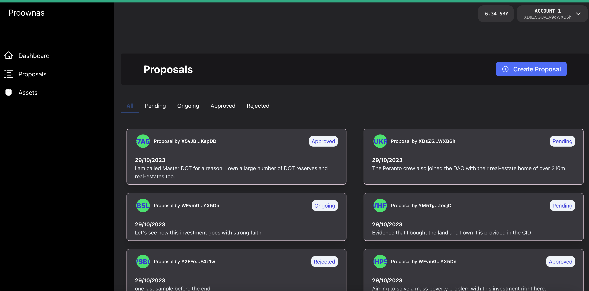
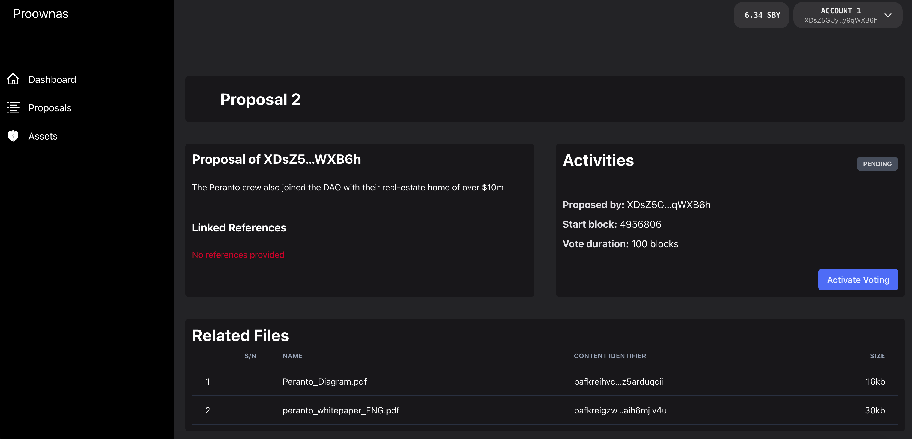
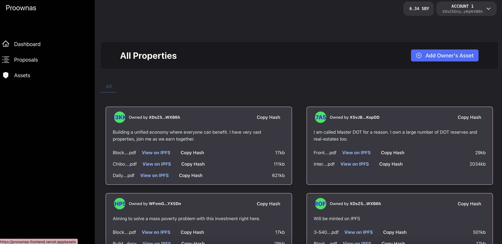

## Frontend Demo

The frontend is made up of 4 pages

- Dashboard | Homepage: Shows some basic stats and should also contain quick links to settings feature (_coming soon!_).

 

- Proposals page: On this page, user can see the list of proposals and also filter by their status. This also has a modal that can be used to create new proposals.

    
    
 

- Proposals by ID page: This is a page where you can view more information about a proposal, activate and end the voting period and also vote on proposals. If the proposal is approved, you can also initiate the asset minting from here.

    

- Assets page: View a list of all assets that have been on-chain on this page. DAO members can also use this page too add default assets to the contract

    

## Deployment

The frontend is currently hosted on Vercel, you can copy the link or (visit from here)[https://proownas-frontend.vercel.app/]. There is also a Demo video that is deployed on my Youtube, _be sure to subscribe_. Here is the link to the video, (Proownas Pitchdeck)[https://youtu.be/t8FFb16q5pE]
